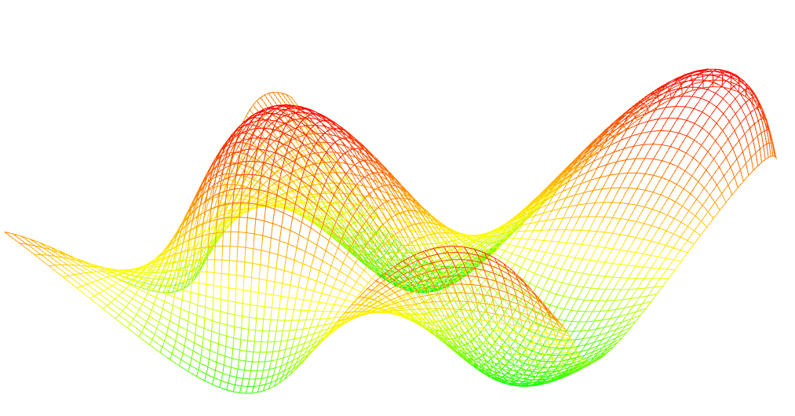
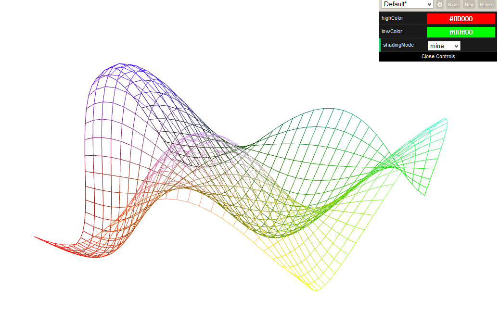
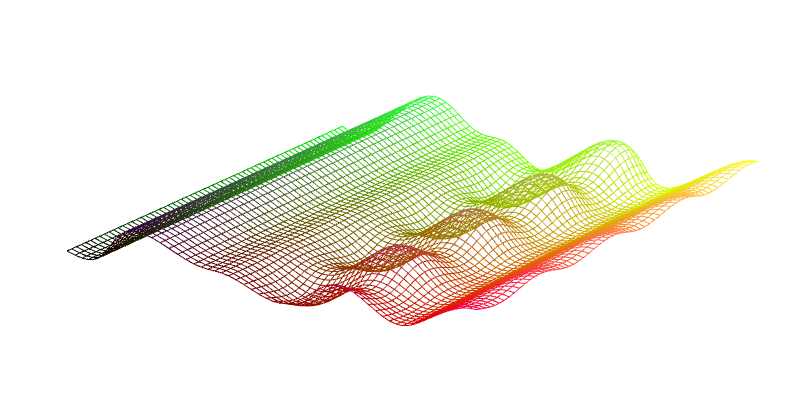
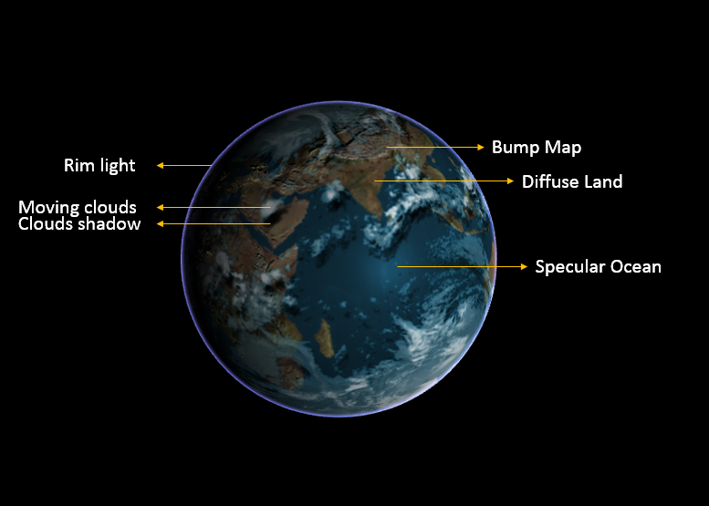

-------------------------------------------------------------------------------
CIS565: Project 5: WebGL
-------------------------------------------------------------------------------

Latest version of Firefox is required for this project.  

Part 1 is an implementation of a sin-shaded moving wave by GLSL vertex shading and fragment shading.  

Part 2 is an implementation of a GLSL fragment shader to render an interactive globe in WebGL.  


-------------------------------------------------------------------------------
PART 1 WebGL Vertex Wave
-------------------------------------------------------------------------------
A dynamic wave animation using code that runs entirely on the GPU.
**Mouse Interaction**  
I migrated the mouse interaction from Globe to here. This add more interactivity to the simulation.


**Height Shading**  
Click Here for [Live Demo Page](https://dl.dropboxusercontent.com/u/53181465/webGL/vert_wave.html)
The vertex grid will bw shaded based on height, and the colors chosen by user.
The maxima will be shaded with `highColor`, and the minima will be shaded with `lowColor`



 
**My Shading**  
I did the shading in the same file as first shading. And this time I include a drop-down menu to select between shading modes.
In the drop-down menu, choose 'normal' or 'mine' to switch between height shading, and my shading mode.


In the vertex shader, find the property of a vertex:
```
xCol = clamp(position.x,0.0,1.0);
yCol = clamp(position.y,0.0,1.0);
zCol = clamp(height,0.0,1.0);
```

In the fragment shader, the color of a vertex is determined as follows:
```gl_FragColor = vec4(xCol, yCol, zCol, 1.0);```

Hence, the vertex is shading by its position.

**Another Vertex Shader: Perlin Noise**   

Click Here for [Live Demo Page](https://dl.dropboxusercontent.com/u/53181465/webGL/vert_wave_custom.html)   

  

I tried to implement a perlin noise vertex shader, and the result looks interesting though doesn't looks correct as a perlin noise.  
Firstly, I created a index permutation lookup table, and a gradient lookup table, and loaded them and 2D texture to the vertex shader.  
In the vertex shader, I used the position of vertex for find its index permutation and gradient. For each vertex, the noise comtribution is summer for four vertices, i.e, `x,y`, `x,y+1`, `x+1,y`, `x+1,y+1`. Then, calculate normal from gradient and position. Lastly mix the noise contribution in 3 directions `x`, `y`,`z`, and get a `float` value noise, which should be used as the height value in vertex shader.


-------------------------------------------------------------------------------
PART 2 Globe
-------------------------------------------------------------------------------

* Bump mapped terrain
* Rim lighting to simulate atmosphere
* Night-time lights on the dark side of the globe
* Specular mapping
* Moving clouds

You are also required to pick one open-ended effect to implement:

* Cloud shadows via ray-tracing through the cloud map in the fragment shader  
I did it though find the light direction, and shade the shadow according to cloud transparency map.  
* Draw a skybox around the entire scene for the stars  
I tried to load a skybox into the scene, but failed in initializing the cube mesh. Succeded in loading textures for skybox.    
Click Here for [Live Demo Page](https://dblsai.github.io/Project5-WebGL)  
  


-------------------------------------------------------------------------------
PERFORMANCE EVALUATION
-------------------------------------------------------------------------------
Vertex Wave: ~60 fps
Custom Perlin Noise Wave: ~56 fps

-------------------------------------------------------------------------------
REFERENCES
-------------------------------------------------------------------------------
Perlin Noise & Simplex Noise: http://stackoverflow.com/questions/4200224/random-noise-functions-for-glsl  
A Very Good FPS recorder:  https://github.com/mrdoob/stats.js  
SKYBOX: http://stackoverflow.com/questions/10079368/how-would-i-do-environment-reflection-in-webgl-without-using-a-library-like-thre/10093646#10093646  
SKYBOX:   http://math.hws.edu/eck/cs424/notes2013/webgl/skybox-and-reflection/skybox.html   
SKYBOX:   http://www.script-tutorials.com/webgl-with-three-js-lesson-5/   
