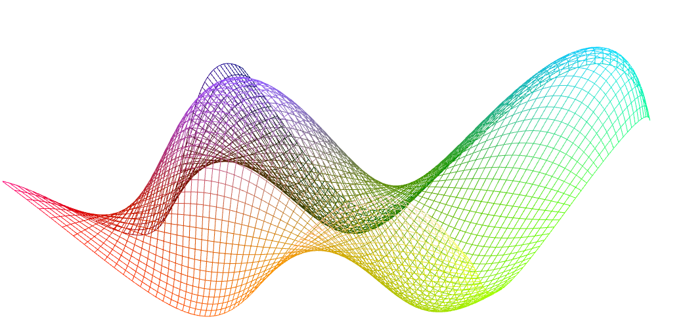

-------------------------------------------------------------------------------
CIS565: Project 5: WebGL
-------------------------------------------------------------------------------


-----------------------------------------------------------------------------
INTRODUCTION:
-------------------------------------------------------------------------------
Latest version of Firefox is required for this project.
Part 1 is an implementation of a sin-shaded moving wave by GLSL vertex shading and fragment shading. 


In the second part of this project, you will implement a GLSL fragment shader
to render an interactive globe in WebGL. This will include texture blending,
bump mapping, specular masking, and adding a cloud layer to give your globe a 
uniquie feel.


-------------------------------------------------------------------------------
PART 1 WebGL Vertex Wave
-------------------------------------------------------------------------------
a dynamic wave animation using code that runs entirely on the GPU.


**Height Shading**

The vertex grid will bw shaded based on height, and the colors chosen by user.
The maxima will be shaded with `highColor`, and the minima will be shaded with `lowColor`


Click Here for [Live Demo Page](https://github.com/dblsai/Project5-WebGL/vert_wave.html)


 
**My Shading**
I did the shading in the same file as first shading. And this time I include a drop-down menu to select between shading modes.
In the drop-down menu, choose 'normal' or 'mine' to switch between height shading, and my shading mode.


In the vertex shader, find the property of a vertex:
```
xCol = clamp(position.x,0.0,1.0);
yCol = clamp(position.y,0.0,1.0);
zCol = clamp(height,0.0,1.0);
```

In the fragment shader, the color of a vertex is determined as follows:
```gl_FragColor = vec4(xCol, yCol, zCol, 1.0);```

Hence, the vertex is shading by its position.


-------------------------------------------------------------------------------
PART 2 REQUIREMENTS:
-------------------------------------------------------------------------------
In Part 2, you are given code for:

* Reading and loading textures
* Rendering a sphere with textures mapped on
* Basic passthrough fragment and vertex shaders 
* A basic globe with Earth terrain color mapping
* Gamma correcting textures
* javascript to interact with the mouse
  * left-click and drag moves the camera around
  * right-click and drag moves the camera in and out

You are required to implement:

* Bump mapped terrain
* Rim lighting to simulate atmosphere
* Night-time lights on the dark side of the globe
* Specular mapping
* Moving clouds

You are also required to pick one open-ended effect to implement:

* Procedural water rendering and animation using noise 
* Shade based on altitude using the height map
* Cloud shadows via ray-tracing through the cloud map in the fragment shader
* Orbiting Moon with texture mapping and shadow casting onto Earth
* Draw a skybox around the entire scene for the stars.
* Your choice! Email Liam and Patrick to get approval first

Finally in addition to your readme, you must also set up a gh-pages branch 
(explained below) to expose your beautiful WebGL globe to the world.

Some examples of what your completed globe renderer will look like:


Figure 0. Completed globe renderer, daylight side.


Figure 1. Completed globe renderer, twilight border.


Figure 2. Completed globe renderer, night side.

-------------------------------------------------------------------------------
PART 2 WALKTHROUGH:
-------------------------------------------------------------------------------

Open part2/frag_globe.html in Firefox to run it. You’ll see a globe 
with Phong lighting like the one in Figure 3. All changes you need to make 
will be in the fragment shader portion of this file.


Figure 3. Initial globe with diffuse and specular lighting.

**Night Lights**

The backside of the globe not facing the sun is completely black in the 
initial globe. Use the `diffuse` lighting component to detect if a fragment 
is on this side of the globe, and, if so, shade it with the color from the 
night light texture, `u_Night`. Do not abruptly switch from day to night; 
instead use the `GLSL mix` function to smoothly transition from day to night 
over a reasonable period. The resulting globe will look like Figure 4. 
Consider brightening the night lights by multiplying the value by two. 

The base code shows an example of how to gamma correct the nighttime texture:

```glsl
float gammaCorrect = 1/1.2;
vec4 nightColor = pow(texture2D(u_Night, v_Texcoord), vec4(gammaCorrect));
```

Feel free to play with gamma correcting the night and day textures if you 
wish. Find values that you think look nice!


Figure 4. Globe with night lights and day/night blending at dusk/dawn.

**Specular Map** 

Our day/night color still shows specular highlights on landmasses, which 
should only be diffuse lit. Only the ocean should receive specular highlights. 
Use `u_EarthSpec` to determine if a fragment is on ocean or land, and only 
include the specular component if it is in ocean.


Figure 5. Globe with specular map. Compare to Figure 4. Here, the specular 
component is not used when shading the land.

**Clouds**

In day time, clouds should be diffuse lit. Use `u_Cloud` to determine the 
cloud color, and `u_CloudTrans` and `mix` to determine how much a daytime 
fragment is affected by the day diffuse map or cloud color. See Figure 6.

In night time, clouds should obscure city lights. Use `u_CloudTrans` and `mix` 
to blend between the city lights and solid black. See Figure 7.

Animate the clouds by offseting the `s` component of `v_Texcoord` by `u_time` 
when reading `u_Cloud` and `u_CloudTrans`.


Figure 6. Clouds with day time shading.


Figure 7. Clouds observing city nights on the dark side of the globe.

**Bump Mapping**

Add the appearance of mountains by perturbing the normal used for diffuse 
lighting the ground (not the clouds) by using the bump map texture, `u_Bump`. 
This texture is 1024x512, and is zero when the fragment is at sea-level, and 
one when the fragment is on the highest mountain. Read three texels from this 
texture: once using `v_Texcoord`; once one texel to the right; and once one 
texel above. Create a perturbed normal in tangent space:

`normalize(vec3(center - right, center - top, 0.2))`

Use `eastNorthUpToEyeCoordinates` to transform this normal to eye coordinates, 
normalize it, then use it for diffuse lighting the ground instead of the 
original normal.


Figure 8. Bump mapping brings attention to mountains.

**Rim Lighting**

Rim lighting is a simple post-processed lighting effect we can apply to make 
the globe look as if it has an atmospheric layer catching light from the sun. 
Implementing rim lighting is simple; we being by finding the dot product of 
`v_Normal` and `v_Position`, and add 1 to the dot product. We call this value 
our rim factor. If the rim factor is greater than 0, then we add a blue color 
based on the rim factor to the current fragment color. You might use a color 
something like `vec4(rim/4, rim/2, rim/2, 1)`. If our rim factor is not greater 
than 0, then we leave the fragment color as is. Figures 0,1 and 2 show our 
finished globe with rim lighting.

For more information on rim lighting, 
read http://www.fundza.com/rman_shaders/surface/rim_effects/index.html.


-------------------------------------------------------------------------------
PERFORMANCE EVALUATION
-------------------------------------------------------------------------------
The performance evaluation is where you will investigate how to make your 
program more efficient using the skills you've learned in class. You must have
performed at least one experiment on your code to investigate the positive or
negative effects on performance. 

We encourage you to get creative with your tweaks. Consider places in your code
that could be considered bottlenecks and try to improve them. 

Each student should provide no more than a one page summary of their
optimizations along with tables and or graphs to visually explain any
performance differences.

In this homework, we do not expect crazy performance evaluation in terms of
optimizations.  However, it would be good to take performance benchmarks at
every step in this assignment to see how complicated fragment shaders affect the
overall speed.  You can do this by using stats.js.
